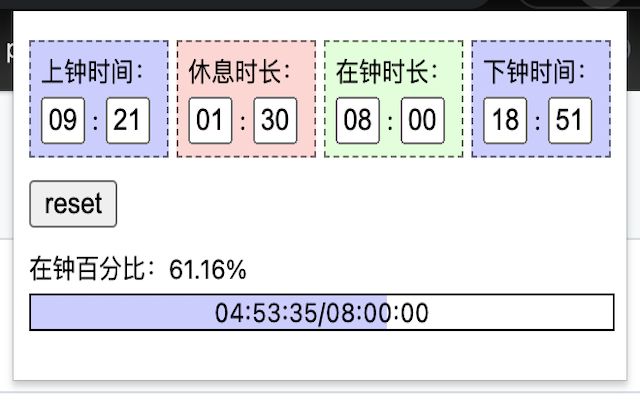

## 预览图

## 项目名称
working timer

## 项目介绍
一个用于计算工作时间的计时器

## 使用方式
Chrome 插件

## 感谢
感谢帮忙打榜的兄（技）弟（师） ..
- 1号：[daweedkob](https://github.com/daweedkob)
- 2号：[Qquanwei](https://github.com/Qquanwei)
- 3号：[Vicew](https://github.com/Vicew)
- 4号：[xdliyushen](https://github.com/xdliyushen)
- 5号：[shenyizhou](https://github.com/shenyizhou)
- 6号：[lkangle](https://github.com/lkangle)
- 7号：[shizhipeng](https://github.com/shizhipeng)
- 8号：[yuzai](https://github.com/yuzai)
- 9号：[BoBoooooo](https://github.com/BoBoooooo)
- 10号：[wupeng2506](https://github.com/wupeng2506)
- ..
